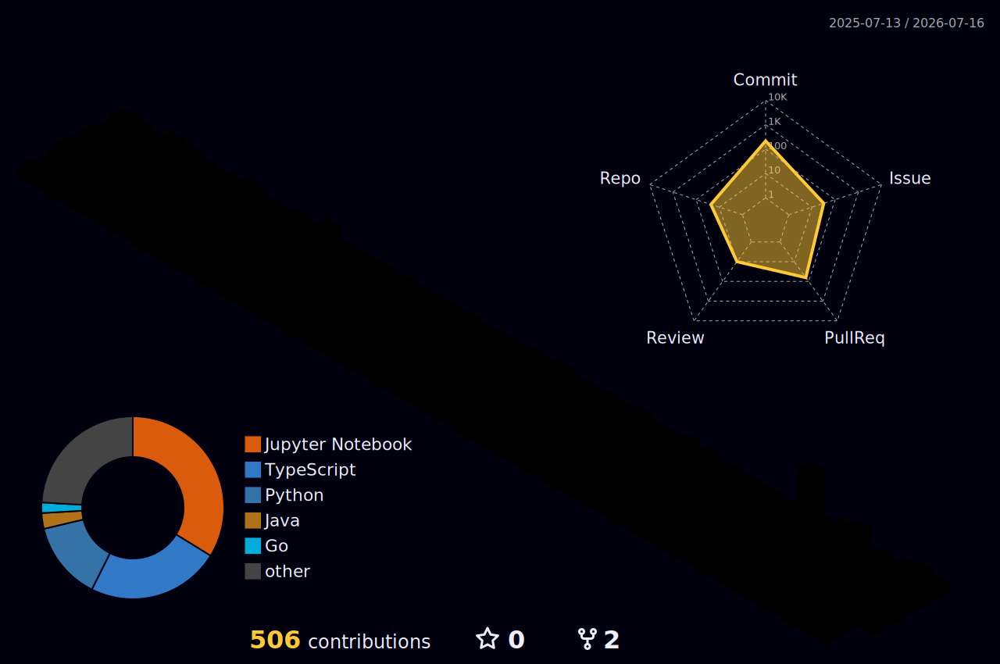

<picture>
  
</picture>

<p align="center">
  
</p>

<p align="center">
  
  &nbsp;
  <a href="https://mounil-k.vercel.app">
    
  </a>
  &nbsp;
  <a href="https://linkedin.com/in/mounil-kankhara-ab90122a4">
    
  </a>
  &nbsp;
  <a href="https://orcid.org/0009-0002-3836-4590">
    
  </a>
  &nbsp;
  <a href="mailto:mounilkankhara@gmail.com">
    
  </a>
</p>

---

## About

B.Tech IT student at Manipal University Jaipur with 4 published/accepted research papers, a committer seat at Hiero (open-source distributed ledger SDKs), and a software development internship that went from "build the website" to owning the entire production stack.

I work across AI/ML research, open source contribution, and software engineering — not as separate tracks, but as the same habit of showing up for hard problems and shipping something real.

```text
🔭  Currently building   → IMPRINT, an AI-generated content detector for web & code
🌱  Currently exploring  → federated learning on edge hardware (Jetson Nano · Qualcomm)
💬  Ask me about         → NLP, federated learning, or turning a paper into shipped code
⚡  Fun fact             → I'm also the guy campus companies call to run the placement drive
```

---

## Research

Four publications across NLP, federated learning, computer vision, and privacy-preserving ML.

| Paper | Venue | Status |
|-------|-------|--------|
| [**Behavioral Conditioning & Analogical Retrieval for Emotionally Intelligent LLMs**](https://aclanthology.org/2025.analogyangle-1.7/) | ACL 2025 | Published |
| [**Privacy-Preserving ECG Classification via Federated Learning** (FedDefender)](https://link.springer.com/chapter/10.1007/978-3-032-10753-4_34) | ICDSA 2025 | Published |
| **MAGLFormer: Unified Transformer for Image Restoration** | SSIC 2025 | Accepted |
| **Federated Learning for Remote Sensing Image Analysis** | Book Chapter | In press |

Full record: [ORCID · 0009-0002-3836-4590](https://orcid.org/0009-0002-3836-4590)

---

## Experience

**Software Developer Intern** &nbsp;·&nbsp; [Autellia Technology](https://autellia.com) &nbsp;·&nbsp; `Sep 2025 – May 2026 · Remote`

Frontend built from scratch. Sanity.io CMS modeled so the team edits content without touching code. Data flow cleaned up and the whole thing deployed to production on the company domain. One production site, real clients looking at it every day.

`Next.js` `React` `TypeScript` `Sanity.io` `Content Modeling` `Tailwind CSS` `Responsive Design` `SEO` `GoDaddy` `DNS & Deployment`

---

## Projects

**[IMPRINT](https://www.imprint.codes/) &nbsp;·&nbsp; [Source](https://github.com/Mounil2005/imprint)**

Paste a URL or a GitHub repo. Imprint crawls it, fingerprints the DOM and the code, and scores how much of it was machine-generated — pattern detection, custom scoring heuristics, and a verdict you're welcome to argue with.

`Next.js` `TypeScript` `Playwright` `Tailwind CSS` `Docker` `DOM Analysis` `Heuristic Scoring` `Web Crawling` `Vercel`

---

**[CodeTracker](https://github.com/Mounil2005/FutureMind-Coder)**

Competitive programming tracker syncing activity from LeetCode, Codeforces, CodeChef, AtCoder, and GitHub. Contribution heatmaps, streaks, a markdown problem journal, and a Chrome extension with a built-in Pomodoro.

`Next.js 15` `TypeScript` `Tailwind CSS` `Supabase` `PostgreSQL` `Row Level Security` `Recharts` `GraphQL` `REST APIs` `Chrome Extension`

---

**[Selenium Test Suite](https://github.com/Mounil2005/selenium-pom-framework)**

End-to-end UI test framework on the Page Object Model. Explicit waits, headless runs, HTML reports, and CI that runs the full suite on every push.

`Python` `Selenium 4` `pytest` `Page Object Model` `webdriver-manager` `pytest-html` `GitHub Actions` `CI/CD`

---

## Open Source

**Hiero** &nbsp;·&nbsp; Open-source distributed ledger SDKs &nbsp;·&nbsp; `Junior Committer · hiero-sdk-python`

- 30+ pull requests merged across the Python SDK, Go SDK, and hiero.org website
- Features, bug fixes, code reviews, issue triage, and roadmap discussions as a committer

`Python` `Go` `TypeScript` `Next.js` `React` `SDK Engineering` `Distributed Systems`

---

**Scribe** &nbsp;·&nbsp; Privacy-first language keyboards &nbsp;·&nbsp; `Contributor · Scribe-Android & Scribe-iOS`

- Contributions merged in both the Android (Kotlin) and iOS apps
- Working with Wikidata-driven language data across platforms

`Kotlin` `Android` `iOS` `Mobile Development` `Localization`

---

**Canasta / Wikimedia** &nbsp;·&nbsp; `Contributor · Canasta CLI & CanastaWiki · Road to Wiki Cohort 2`

- Canasta CLI contributions — MediaWiki hosting turned into one command
- One of five students selected from MUJ for Road to Wiki Cohort 2
- Co-organized the Road to Wiki flagship event with 100 shortlisted participants
- Student Convenor: Pixel to Product hackathon — 100+ participants, Wikimedia's 25th birthday

`Python` `Docker` `MediaWiki` `CLI Development` `Community Building` `Open Knowledge`

---

## Leadership & Operations

**Central Student Placement Coordinator** &nbsp;·&nbsp; Manipal University Jaipur

A small central team sits between the student body and every company hiring from campus — coordinating JDs, eligibility lists, interview panels, shortlists, and offer rollouts end-to-end.

Other roles: Community Manager, ACM Club &nbsp;·&nbsp; Student Convenor, SSIC 2025 &nbsp;·&nbsp; Logistics lead for two Wikimedia events (100+ participants each).

> Most of what's on this page started the same way: something needed doing, nobody was quite sure how, and I said I'd figure it out. A placement drive, a hackathon for a hundred people, a codebase I'd never seen. Same answer every time.

---

## Tech Stack

**AI / ML**


**Web / Full-Stack**


**Systems / DevOps**


---

## Certifications

| Year | Certification | |
|------|--------------|---|
| 2018 | Trinity College London · Communication Skills | |
| 2024 | Oracle · Database Programming with SQL | [View](https://drive.google.com/file/d/1pJyPxLZXSj83dZT7RrhQmMqQtpaZ1Y1A/view?usp=sharing) |
| 2025 | Google AI Essentials | [View](https://drive.google.com/file/d/1i_C5xkhEyOxFoUvl-OvFiUos8ZHvubH5/view?usp=sharing) |
| 2026 | NVIDIA · AI on Jetson Nano | [View](https://drive.google.com/file/d/1TWZo8HOOrbUM78oeUTGXM0LaoW3zonjd/view?usp=sharing) |
| 2026 | Qualcomm · Model-to-App Development | [View](https://drive.google.com/file/d/1PQWE9voDkPXfIdLfANa334eKyZV2bRSU/view?usp=sharing) |
| 2026 | Cisco · Introduction to Modern AI | [View](https://drive.google.com/file/d/1RMa_wpl2nWmgxPat1aW0HaMfvXcdM7ZF/view?usp=sharing) |
| 2026 | SAP Analytics Cloud · Exploring | [View](https://drive.google.com/file/d/1DbkqYx3ijzQO-dQtLVaeW3T6TrtjQEc-/view?usp=sharing) |
| 2026 | SAP Analytics Cloud · Designing Stories | [View](https://drive.google.com/file/d/1z8EA0ocJHrue8iIsPmYeitAIslwtqlSv/view?usp=sharing) |
| 2026 | SAP Analytics Cloud · Manual Planning | [View](https://drive.google.com/file/d/1rulDYQ-yrO-iN72Z7ZBFmIr33Nc-h2xo/view?usp=sharing) |

---

## GitHub Stats

<p align="center">
  
  
</p>

<p align="center">
  
</p>

<p align="center">
  
</p>

<p align="center">
  
</p>

<p align="center">
  
</p>

---

## Connect

<p align="center">
  <a href="https://mounil-k.vercel.app">
    
  </a>
  &nbsp;
  <a href="https://linkedin.com/in/mounil-kankhara-ab90122a4">
    
  </a>
  &nbsp;
  <a href="mailto:mounilkankhara@gmail.com">
    
  </a>
  &nbsp;
  <a href="https://orcid.org/0009-0002-3836-4590">
    
  </a>
  &nbsp;
  <a href="https://www.instagram.com/mounil_2005">
    
  </a>
</p>

<p align="center"><i>B.Tech Information Technology · Manipal University Jaipur · 2023–27</i></p>

<picture>
  
</picture>
